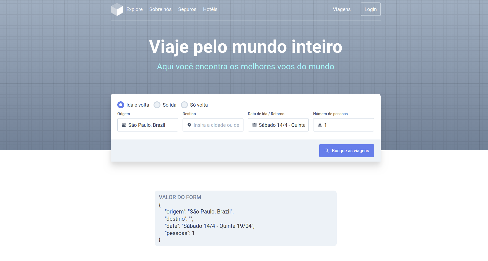

<p align="center">
  

  

  <a href="https://github.com/MarcosWillianR/teste-frontend2/commits/master">
    
  </a>

  

  <a href="https://github.com/MarcosWillianR/teste-frontend2/stargazers">
    
  </a>

  <a href="https://github.com/MarcosWillianR">
    
  </a>
</p>

<h4 align="center" style="font-size: 26px; font-weight: bold;">
	Viaje pelo mundo inteiro ;)
</h4>

### Web

<p align="center" style="display: flex; align-items: flex-start; justify-content: center;">
  
</p>

<p align="center" style="display: flex; align-items: flex-start; justify-content: center;">
  
</p>

### Pré-requisitos

Antes de começar, você vai precisar ter instalado em sua máquina as seguintes ferramentas:
[Git](https://git-scm.com), [Node.js](https://nodejs.org/en/).
Além disto é bom ter um editor para trabalhar com o código como [VSCode](https://code.visualstudio.com/)

#### 🧭 Rodando a aplicação web (Frontend)

```bash

# Clone este repositório
$ git clone https://github.com/MarcosWillianR/teste-frontend2

# Acesse a pasta do projeto no seu terminal/cmd
$ cd teste-frontend2

# Instale as dependências
$ npm install ou yarn

# Execute a aplicação em modo de desenvolvimento
$ npm start ou yarn start

# A aplicação será aberta na porta:3000 - acesse http://localhost:3000

```

## 🛠 Tecnologias

As seguintes ferramentas foram usadas na construção do projeto:

#### **Website**  ([React](https://reactjs.org/)  +  [TypeScript](https://www.typescriptlang.org/))

-   **[Styled Components](https://github.com/styled-components/styled-components)**
-   **[Unform](https://github.com/Rocketseat/unform)**

> Veja o arquivo  [package.json](https://github.com/MarcosWillianR/teste-frontend2/blob/master/package.json)

## 🦸 Autor

 
 <br />
 <sub><b>Marcos Willian</b></sub></a>
 <br />

[](https://www.linkedin.com/in/marcos-willian-977311188/)
[](markusuuuu@gmail.com)

---

## 📝 Licença

Este projeto esta sobe a licença [MIT](./LICENSE).

Feito com ❤️ por Marcos Willian 👋🏽 [Entre em contato!](https://www.linkedin.com/in/marcos-willian-977311188/)
